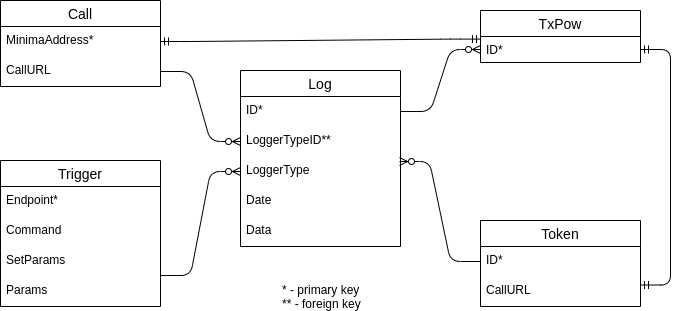

# Knowledge Base

Below describes the MEG application.

## Architecture diagram of the system and a description of the key components


## Process flow


## Schema diagrams



## Any design decisions that were made during the build or after

The MEG was built using an Agile process involving weekly sprint reviews of working builds. The initial build was created using a [specification](./specification.md) created from the very first of those sprint meetings.

## Any quirks/workarounds that have been made so we have them captured

None, currently.

## Any outside dependencies/services that we may use - email api's etc

None.

## Any processes/services that are running on the backend - like doing any repeating tasks, or clean ups, resets, etc

The MEG relies on _service.js_, which continually runs in the background whenever Minima itself is running.

## A list of the key processes, that are trigged by the userflow or a event, what steps occur in what order etc

When _service.js_ first loads, it creates the database, establishes a default API and creates a listener that responds to API calls and posts information about specified tokens and addresses to any defined external URL.

Create the database:

```
/**
 * Creates log table
 * @function createLog
 */
function createLog()

/**
 * Creates TxPow table
 * @function createTxPow
 */
function createTxPow()

/**
 * Creates call table
 * @function createCall
 */
function createAddress()

/**
 * Creates token table
 * @function createToken
 */
function createToken()

/**
 * Creates trigger table
 * @function createTrigger
 */
function createTrigger()
```

Create the default API:

```
/**
 * Creates an API for adding default URL for token and address listeners
 * @function createURLAPI
 */
function createURLAPI()

/**
 * Creates an API for adding Addresses for which you're interested
 * @function createAddressListenAPI
 */
function createAddressListenAPI()

/**
 * Creates an API for adding Tokens for which you're interested
 * @function createTokenListenAPI
 */
function createTokenListenAPI()

/**
 * Creates an API for making it possible to get data out of the database
 * @function createGetDbaseAPI
 */
function createGetDbaseAPI()

/**
 * Creates an API for gimme50
 * @function createGimme50API
 */
function createGimme50API()

/**
 * Creates an API for making it possible to send transactions
 * @function createSendAPI
 */
function createSendAPI()

/**
 * Creates an API for making it possible to create tokens
 * @function createAddressListenAPI
 */
function createTokenAPI()

/**
 * Creates an API for retreiving balance info
 * @function createBalanceAPI
 */
function createBalanceAPI()

/**
 * Creates an API for retreiving address info
 * @function createScriptsAPI
 */
function createScriptsAPI()

/**
 * sets the default URL used when inserting tokens and addresses
 * @function setDefaultURL
 * @param {object} qParamsJSON
 * @param {string} replyId
*/
function setDefaultURL(qParamsJSON, replyId)

/**
 * Creates address entries to listen for
 * @function insertAddress
 * @param {object} qParamsJSON
 * @param {string} replyId
*/
function insertAddress(qParamsJSON, replyId)

/**
 * Creates token entries to listen for
 * @function insertToken
 * @param {object} qParamsJSON
 * @param {string} replyId
*/
function insertToken(qParamsJSON, replyId)

/**
 * Runs dbase queries
 * @function getDbase
 * @param {object} qParamsJSON
 * @param {string} replyId
*/
function getDbase(qParamsJSON, replyId)
```

Process API calls:

```
/**
 * Processes any API calls
 * @function processApiCall
 * @param {string} qParams
 * @param {string} replyId
*/
function processApiCall(qParams, replyId)
```

Call external URL:

```
/**
 * Calls external URL
 * @function processURL
 * @param {string} txId
 * @param {string} uRL
 * @param {string} address
 * @param {string} tokenId
 * @param {string} state
*/
function processURL(txId, uRL, address, tokenId, state)
```

## The different user roles we have, what permissions/actions do each of the roles have

None, currently.

## any known limitations, constraints, issues, caveats

None, currently.

## any do's, any don'ts (these would may map back to the design decisions, quirks/workarounds)

None, currently.
