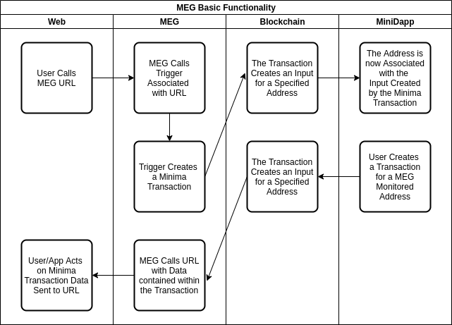

# Knowledge Base

Below describes the MEG application.

## Architecture Diagram


## Process Flow



## Database Schema


## Design Decisions

The MEG was built using an Agile process involving weekly sprint reviews of working builds. The initial build was created using a [specification](./specification.md) created from the very first MEG meeting.

## Quirks/Workarounds

None, currently.

## Outside Dependencies

None.

## Backend Processes/Services

The MEG relies on [service.js](/src/service.js), which runs continually (whenever Minima itself is running).

### Key Backend Processes

When [service.js](/src/service.js) first loads, it creates the database, establishes a default API and creates a listener that responds to API calls. That listener also posts to any defined external URL information about specified tokens and addresses.

Functions that create the database:

```javascript
/**
 * Creates log table
 * @function createLog
 */
function createLog()

/**
 * Creates TxPow table
 * @function createTxPow
 */
function createTxPow()

/**
 * Creates call table
 * @function createCall
 */
function createAddress()

/**
 * Creates token table
 * @function createToken
 */
function createToken()

/**
 * Creates trigger table
 * @function createTrigger
 */
function createTrigger()
```

Functions that create the default API:

```javascript
/**
 * Creates an API for adding default URL for token and address listeners
 * @function createURLAPI
 */
function createURLAPI()

/**
 * Creates an API for adding Addresses for which you're interested
 * @function createAddressListenAPI
 */
function createAddressListenAPI()

/**
 * Creates an API for adding Tokens for which you're interested
 * @function createTokenListenAPI
 */
function createTokenListenAPI()

/**
 * Creates an API for making it possible to get data out of the database
 * @function createGetDbaseAPI
 */
function createGetDbaseAPI()

/**
 * Creates an API for gimme50
 * @function createGimme50API
 */
function createGimme50API()

/**
 * Creates an API for making it possible to send transactions
 * @function createSendAPI
 */
function createSendAPI()

/**
 * Creates an API for making it possible to create tokens
 * @function createAddressListenAPI
 */
function createTokenAPI()

/**
 * Creates an API for retreiving balance info
 * @function createBalanceAPI
 */
function createBalanceAPI()

/**
 * Creates an API for retreiving address info
 * @function createScriptsAPI
 */
function createScriptsAPI()

/**
 * sets the default URL used when inserting tokens and addresses
 * @function setDefaultURL
 * @param {object} qParamsJSON
 * @param {string} replyId
*/
function setDefaultURL(qParamsJSON, replyId)

/**
 * Creates address entries to listen for
 * @function insertAddress
 * @param {object} qParamsJSON
 * @param {string} replyId
*/
function insertAddress(qParamsJSON, replyId)

/**
 * Creates token entries to listen for
 * @function insertToken
 * @param {object} qParamsJSON
 * @param {string} replyId
*/
function insertToken(qParamsJSON, replyId)

/**
 * Runs dbase queries
 * @function getDbase
 * @param {object} qParamsJSON
 * @param {string} replyId
*/
function getDbase(qParamsJSON, replyId)
```

Functions that process API calls:

```javascript
/**
 * Processes any API calls
 * @function processApiCall
 * @param {string} qParams
 * @param {string} replyId
*/
function processApiCall(qParams, replyId)
```

Functions that call any external URLs:

```javascript
/**
 * Calls external URL
 * @function processURL
 * @param {string} txId
 * @param {string} uRL
 * @param {string} address
 * @param {string} tokenId
 * @param {string} state
*/
function processURL(txId, uRL, address, tokenId, state)
```

## User Roles

None, currently.

## Known Limitations

None, currently.

## Do's and Don'ts (these would may map back to the design decisions, quirks/workarounds)

None, currently.
