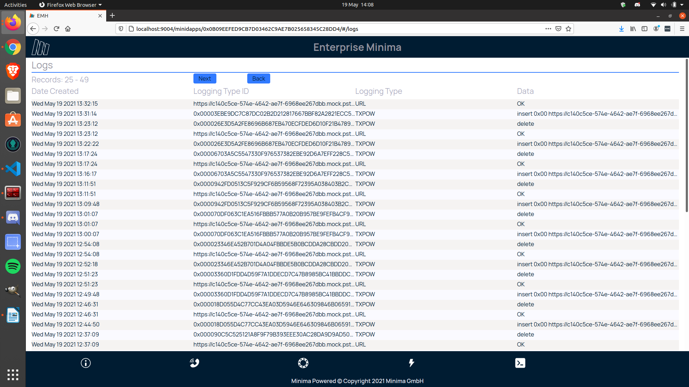
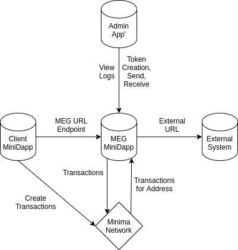

# Overview of the Minima Enterprise Gateway

The Minima Enterprise Gateway (MEG) acts as a bridge between Minima and the World Wide Web (via the `HTTP` protocol). Although the idea is simple, the system has much potential because it provides a link between two powerful concepts - the web and the blockchain.

At its core, the MEG performs three functions (shown in Figure 1, below):

1. Listens for calls to specified URL-based endpoints, which then _trigger_ Minima transactions. For example, a `gimme50` endpoint triggers a Minima transaction that distributes 50 tokens (the callee specifies to whom and exactly which tokens to send).
2. Listens for Minima transactions at specified addresses and calls URLs with data within those transactions.
3. Listens for Minima transactions involving specified tokens and calls URLs with data within those transactions.

## The MEG Admin Application

The MEG features a pre-built admin’ app’ - Figure 2 below shows an early prototype. The app' performs some basic administrator functionality that allows users to:

1. View a log of all actions taken by the MEG
2. Specify Minima addresses and tokens for which the MEG should listen for transactions and to which URL it should call in turn
3. Add triggers to URL endpoints
4. Run triggers

The MEG admin’ app’ is itself a Minima distributed application (MiniDapp). Thus, as well as performing all the MEG administration functions, it also demonstrates the power of Minima MiniDapps.

## MEG System Overview

Finally, Figure 3 below shows an overview of the constituent parts that make up the MEG system.

Minima’s creation of the software at the centre of Figure 3 means that exciting times lay ahead because there are endless possibilities for the client applications and the uses they might unlock for external systems.
