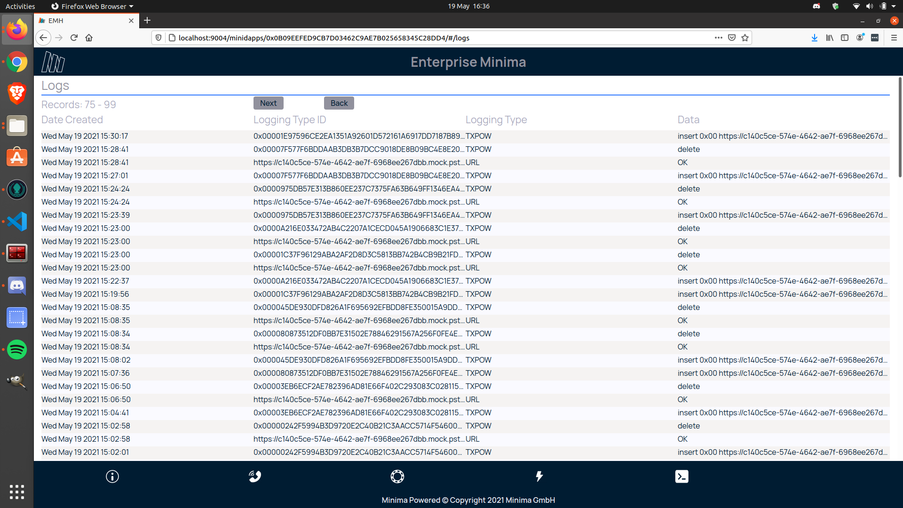

# Overview of the Enterprise Management Hub

The Enterprise Management Hub (EMH) acts as a gateway between Minima and the World Wide Web (via the `HTTP` protocol). Although the idea is simple, the application has much potential because it unlocks a bridge between two powerful concepts - the web and the blockchain.

At its core, the EMH performs three functions (shown in Figure 1[^Figure1], below):

1. Listens for calls to specified URL-based endpoints, which then _trigger_ Minima transactions. For example, a `gimme50` endpoint triggers a Minima transaction that distributes 50 tokens (the callee specifies to whom and exactly which tokens to send).
2. Listens for Minima transactions at specified addresses and calls URLs with data within those transactions.
3. Listens for Minima transactions involving specified tokens and calls URLs with data within those transactions.

[^Figure1]: _Figure 1: EMH Basic Workflow_

Additionally, the EMH is a Minima MiniDapp that comes with a pre-built app' - an early prototype is shown in Figure 2[^Figure2], below. The app' performs some basic administrator functionality that allows users to:

1. View a log of all actions taken by the EMH
2. Specify Minima addresses and tokens for which the EMH should listen for transactions; it then calls the URL associated with those transactions
3. Add triggers to URL endpoints
4. Run triggers

[^Figure2]: _Figure 1: EMH Admin Prototype_

Finally, an overview of the EMH workflow is shown in Figure 3[^Figure3], below.

[^Figure3]: _Figure 3: EMH Workflow_
