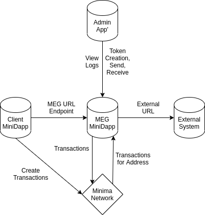

# MEG

This document describes the requirements for the Minima Enterprise Gateway (MEG).

## Functional Requirements

The MEG should perform three functions:

1. Listen for calls at specified URL-based endpoints. Those calls should trigger Minima transactions (and maybe call other URLs, too). For more information on _triggers_, see below.

2. Listen for Minima transactions at certain (configurable) addresses and subsequently, call URLs with data from those transactions.

3. Include the functions of an enterprise-grade _wallet_: token `create`, `send` and `receive`.

### Triggers

The MEG should abstract away from explicit implementation through a process of _triggers_. For example, a `gimme50` URL endpoint would _probably_ be a trigger that gives the user 50 tokens. However, it could just as easily give the user 50 tokens **AND** notify some service 'somewhere' that a user has received 50 tokens.

### Logging

The MEG should log **everything**.

## System Requirements

To meet the [functional requirements](#functional-requirements), above, the MEG should implement the following:

### MiniDapp

The MEG should run as a single-user system that interfaces with `minima.jar`. It performs the following functions:

1. URL-based endpoint(s) that users can call in order to create transactions on the Minima network
2. Calls to make to URLs given Minima transaction sent to a given address or given token
3. The token functionality described above (`create`, `send` and `receive`)
4. Logging

The MEG must be deployable to both server and mobile environments, but it should be a MiniDapp. A user interface to the MiniDapp should allow an MEG admin' to execute the functionality described above; i.e. `create`, `send` and `receive` tokens, review logs, create endpoints and specify actions.

### Database

The MEG will make use of `Minima.sql` to `create` tables and `insert` rows into those tables. Therefore, it should provide an abstraction from any specific database implementation.

#### Database Design

